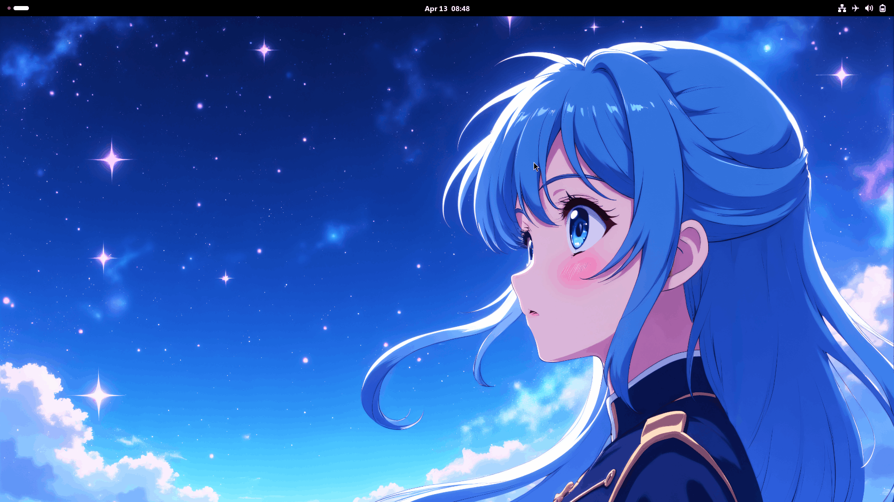
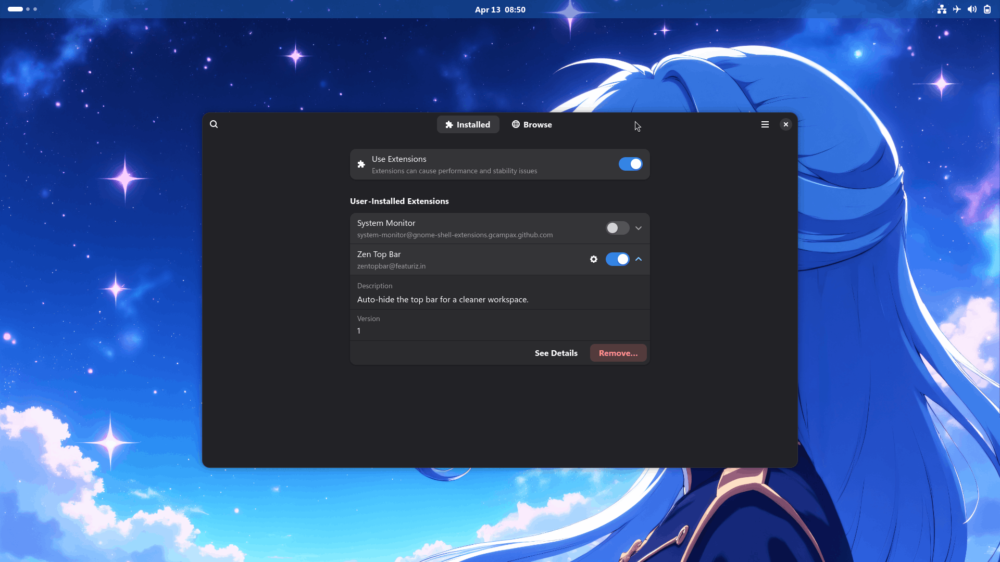
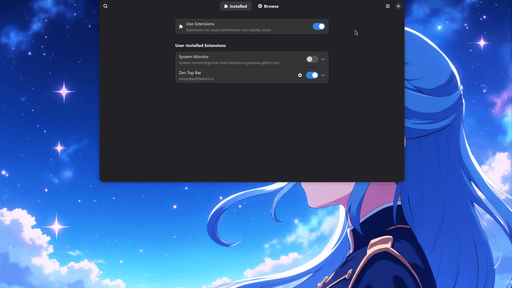
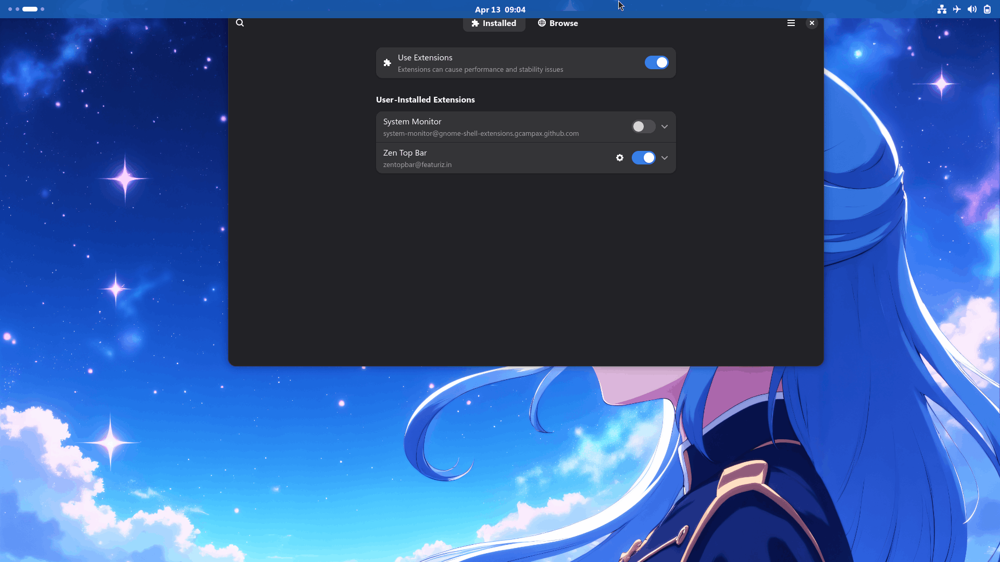
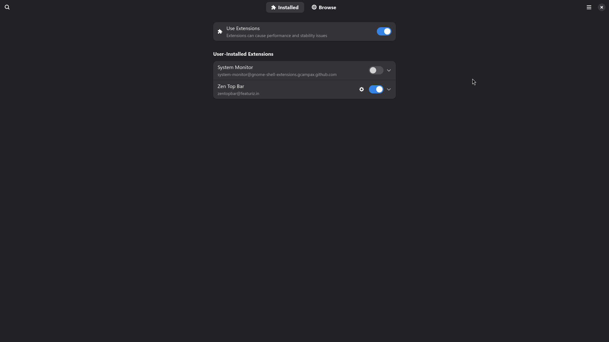
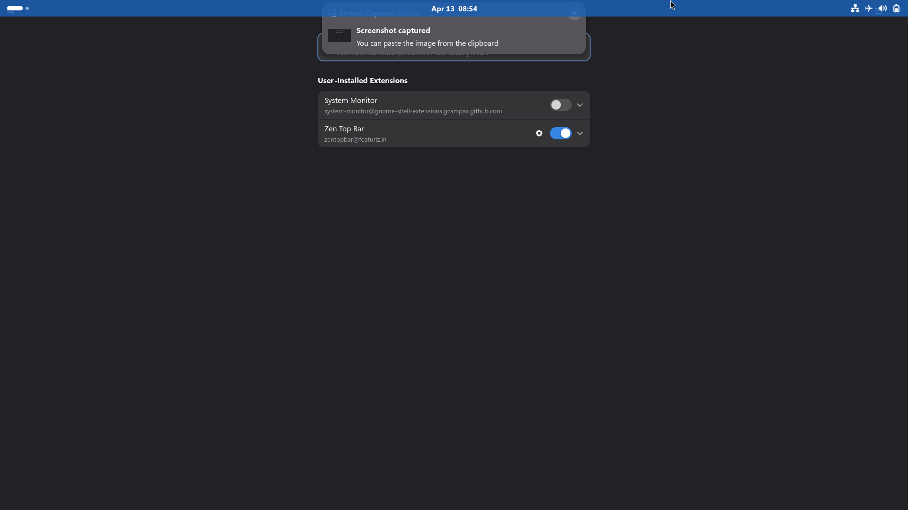
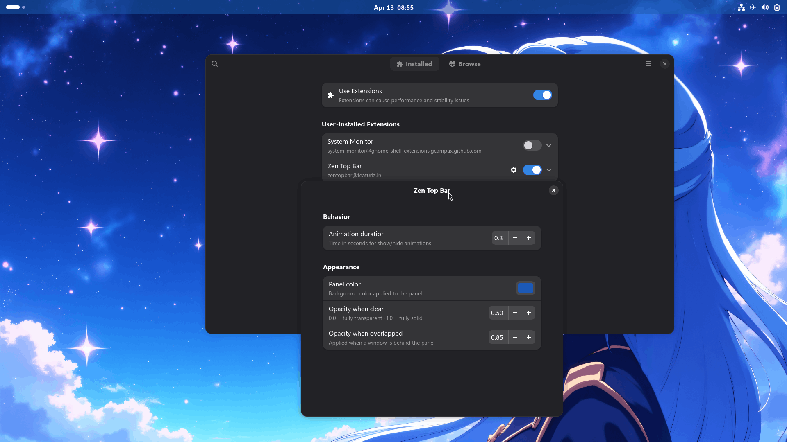

# Zen Top Bar

<p align="center">
  
</p>

<p align="center">
  <a href="https://extensions.gnome.org/extension/9699/zen-top-bar/">
    
  </a>
  <a href="https://github.com/featuriz/zen-top-bar/releases/latest">
    
  </a>
  <a href="https://github.com/featuriz/zen-top-bar/blob/main/LICENSE">
    
  </a>
</p>

<p align="center">
  <b>A modern GNOME Shell extension that intelligently hides the top bar and lets you customize its transparency and color — for a cleaner, more focused desktop.</b>
</p>

---

## 📖 Overview

**Zen Top Bar** brings intelligent auto-hide behavior and visual customization to the GNOME top panel. When a focused window's top edge reaches the panel area, the panel gracefully slides away so you can reclaim the full screen. Move your cursor to the very top edge of the screen and the panel instantly returns.

The panel also adapts its color and transparency to your preference — fully transparent on a clear desktop, or any custom color and opacity you choose.

Built from the ground up for **GNOME Shell 50** using modern ES modules, event-driven signal management, and the latest GNOME APIs. Lightweight, dependency-free, and memory-safe.

---

## Screenshots

<div style="display: flex; overflow-x: auto; gap: 10px;">
  
  
  
  
  
  
  
</div>

---

## ✨ Features

| Feature                       | Description                                                                                 |
| :---------------------------- | :------------------------------------------------------------------------------------------ |
| 🧠 **Smart Window Detection** | Panel hides when the focused window's top edge reaches the panel area (~panel height).      |
| 🖥️ **Full-Screen Aware**      | Panel stays hidden in full-screen applications, regardless of window state.                 |
| 🖱️ **Edge-Triggered Reveal**  | Bump your cursor against the top edge (within 2 px) to show the panel instantly.            |
| 📋 **Menu-Safe**              | Panel stays visible while any system menu is open, regardless of mouse position.            |
| 🎨 **Panel Color**            | Set a fully custom background color for the panel.                                          |
| 💧 **Panel Opacity**          | Control panel transparency independently.                                                   |
| ✨ **Smooth Animations**      | Fluid slide-in/out easing with configurable duration.                                       |
| 🔒 **Safety Toggle**          | A single switch in prefs always restores the panel — even if something goes wrong.          |
| 🌍 **Wayland & X11**          | Compatible with both display servers.                                                       |
| ⚡ **Performance Optimized**  | Event-driven pointer watching, debounced window checks, and proper signal/resource cleanup. |

---

## 🧠 How It Works

The extension defines five states:

| State       | Description                                  | Panel      |
| :---------- | :------------------------------------------- | :--------- |
| **State 0** | Screen is empty, no windows                  | Visible    |
| **State 1** | Window(s) open, all below the panel area     | Visible    |
| **State 2** | A window's top edge is inside the panel area | **Hidden** |
| **State 3** | A window is full-screen                      | **Hidden** |

**In State 2 or 3:** moving your cursor to the top 2 px of the screen reveals the panel. Once your cursor moves below `panel height + margin px`, the panel slides away again (after a configurable delay).

**Menus:** if any panel menu is open, the panel stays visible regardless of cursor position or window state. It re-evaluates hiding only after the menu closes.

**Multiple workspaces:** each workspace is evaluated independently. State on one workspace does not affect another.

---

## 🚀 Supported GNOME Versions

| Version            | Status                          |
| :----------------- | :------------------------------ |
| **GNOME 50**       | ✅ Fully supported and tested   |
| GNOME 47–49        | ✅ Compatible (limited testing) |
| GNOME 46           | ⚠️ May work with minor issues   |
| GNOME 45 and older | ❌ Not supported                |

---

## 🧪 Tested Environments

| Distribution        | GNOME Version | Windowing System | Status              |
| :------------------ | :------------ | :--------------- | :------------------ |
| Arch Linux          | 50.4          | Wayland          | ✅ Fully functional |
| Arch Linux          | 50.4          | X11              | ✅ Fully functional |
| Fedora 42           | 50.0          | Wayland          | ✅ Fully functional |
| Ubuntu 25.04        | 50.1          | Wayland          | ✅ Fully functional |
| openSUSE Tumbleweed | 50.2          | Wayland          | ✅ Fully functional |

If you encounter issues on a different setup, please [open an issue](https://github.com/featuriz/zen-top-bar/issues).

---

## 📦 Installation

### Recommended: Via GNOME Extensions Website

1. Visit the extension page on **[extensions.gnome.org](https://extensions.gnome.org/extension/9699/zen-top-bar/)**.
2. Toggle the switch to **ON**.
3. The extension installs and activates automatically.

### Manual Installation

```bash
# Download the latest release
wget https://github.com/featuriz/zen-top-bar/releases/latest/download/zentopbar@featuriz.in.shell-extension.zip

# Install
gnome-extensions install zentopbar@featuriz.in.shell-extension.zip

# Enable
gnome-extensions enable zentopbar@featuriz.in
```

### Build from Source

```bash
git clone https://github.com/featuriz/zen-top-bar.git
cd zen-top-bar
make install
```

---

## ⚙️ Configuration

Open the **Extensions** app or run:

```bash
gnome-extensions prefs zentopbar@featuriz.in
```

### Appearance

| Setting                 | Description                                                      | Default   |
| :---------------------- | :--------------------------------------------------------------- | :-------- |
| **Visibility**          | Safety toggle — always restores the panel if disabled.           | `on`      |
| **Panel Position**      | Vertical position as % of screen height (0 = top, 100 = bottom). | `0`       |
| **Panel Color**         | Background color of the panel.                                   | `#000000` |
| **Panel Opacity**       | Opacity of the panel (0.0 = invisible, 1.0 = solid).             | `0.85`    |
| **Animation Time (ms)** | Duration of the slide-in/out animation.                          | `300`     |

### Behavior

| Setting                 | Description                                                                        | Default |
| :---------------------- | :--------------------------------------------------------------------------------- | :------ |
| **Hide Delay (ms)**     | How long the panel stays visible after the cursor leaves the panel area.           | `500`   |
| **Hide Margin (px)**    | How far below the panel the cursor must move before the hide timer starts.         | `10`    |
| **Check Interval (ms)** | How often window overlap is evaluated. Lower = more responsive, higher = less CPU. | `100`   |

> **Tip:** Set **Panel Opacity** to `0.0` to make the panel completely invisible on a clear desktop. It will reappear when a window approaches the top or your cursor hits the screen edge.

---

## 🐛 Troubleshooting

| Symptom                                                | Solution                                                                                                                            |
| :----------------------------------------------------- | :---------------------------------------------------------------------------------------------------------------------------------- |
| Panel does not hide when a window touches the top      | Ensure no system menu is open. Try moving the window slightly to trigger re-evaluation.                                             |
| Panel does not appear when cursor touches the top edge | Move the cursor all the way to the screen edge (within 2 px). On multi-monitor setups, ensure the cursor is on the primary display. |
| Panel color or transparency is gone after login        | Upgrade to the latest version — this was fixed by applying styles on initialization.                                                |
| Panel is invisible and not responding                  | Open prefs and raise **Panel Opacity** above `0.0`, or toggle **Visibility** off then back on.                                      |
| Extension fails to load after GNOME Shell restart      | Check logs: `journalctl -f -o cat /usr/bin/gnome-shell` and search for `zentopbar`.                                                 |
| Panel flickers when a menu is open                     | Known GNOME Shell behavior with some themes. The extension includes mitigations but minor flicker may occur.                        |

If problems persist, please [report a bug](https://github.com/featuriz/zen-top-bar/issues/new?template=bug_report.md).

---

## 🤝 Contributing

Contributions are warmly welcomed — bug reports, feature requests, and pull requests all help.

1. Fork the repository.
2. Create a feature branch: `git checkout -b feature/your-feature`.
3. Commit your changes: `git commit -m 'Add your feature'`.
4. Push: `git push origin feature/your-feature`.
5. Open a Pull Request.

---

## 📄 License

Distributed under the **MIT License**. See [`LICENSE`](LICENSE) for details.

---

## 🙏 Acknowledgments

- Inspired by [Hide Top Bar](https://gitlab.gnome.org/tuxor1337/hidetopbar) by tuxor1337.
- Built with the [GNOME Shell Extension Guide](https://gjs.guide/extensions/) and modern ES module patterns.
- Thanks to the GNOME community for continuous support and feedback.

---

<p align="center">
  <sub>Made with ❤️ for the GNOME community</sub>
</p>
